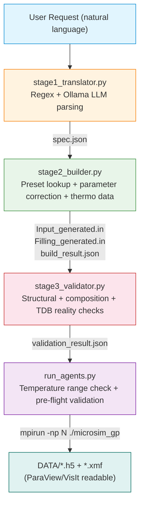

# PFML

**PFML** (Phase-Field Machine Learning) is an AI-assisted pipeline for automating computational materials simulations. It converts natural-language descriptions of alloy systems into executable MPI-parallelized grand-potential phase-field simulations using [MicroSim GP](https://github.com/ICME-India/MicroSim).

Developed during a summer internship at the **Indian Institute of Science (IISc), Bengaluru**.

---

## Overview

Computational materials simulation -- particularly phase-field modeling of alloy microstructures -- requires preparing precise configuration files with thermodynamic parameters, boundary conditions, mesh settings, and phase definitions. Manually translating research intent into these structured inputs is time-consuming and error-prone.

PFML addresses this by combining:

- **LLM-based reasoning** for parsing natural-language simulation requests into structured specifications
- **Deterministic parsing and validation** to ensure physical correctness and solver compatibility
- **Automated simulation file generation** that produces solver-ready `Input.in` and `Filling.in` files
- **Thermodynamic data integration** via pycalphad for equilibrium composition computation

The system uses a **hybrid architecture**: an LLM handles natural-language understanding while deterministic Python code handles all physics computation, parameter correction, and validation. This ensures the pipeline never blindly trusts LLM output.

---

## Motivation

Setting up a phase-field simulation involves:

- Choosing the correct alloy system, phases, and thermodynamic database
- Configuring 40+ parameters across geometry, time-stepping, free energy models, diffusion, elasticity, and boundary conditions
- Ensuring thermodynamic data (equilibrium compositions, Hessians) is physically valid for the requested temperature range
- Matching the exact input format expected by the MicroSim GP solver

A single misconfigured parameter can cause the solver to crash or -- worse -- produce physically meaningless results. PFML reduces this friction by letting researchers express their intent in plain language and handling the configuration details automatically.

---

## Key Features

- **Natural-language input** -- describe your simulation in plain English (e.g., "NiAl with 4 phases at 1700K, mesh 500x500")
- **Hybrid parsing** -- regex-based extraction combined with Ollama-hosted LLM reasoning for flexible input understanding
- **Domain-knowledge-baked LLM** -- MicroSim parameter reference and alloy system catalog baked into the model's system prompt (prompt engineering, not fine-tuning)
- **Garbage input filtering** -- fast regex classification rejects invalid input before it reaches the LLM
- **Automatic parameter correction** -- pads, trims, and validates parameter lengths against NUMPHASES (pairwise vs. per-phase parameters)
- **Thermodynamic data computation** -- pycalphad-based equilibrium solver for systems needing data beyond available presets
- **Multi-stage validation** -- structural sanity, composition range checks, degenerate-phase detection, and independent TDB verification
- **Ghost-system detection** -- guards against configurations with fabricated or degenerate thermodynamic data
- **12 preset alloy systems** -- AlZn, NiAl, NiAlCr, NiAlMo, NiNb, and more, with pre-computed thermodynamic data
- **Dockerized execution** -- single-container deployment with Ollama, MPI, and the C solver compiled at startup
- **Two-machine deployment** -- local simulation client + remote GPU-cluster inference service with authenticated proxy
- **Interactive and one-shot modes** -- guided conversational setup or direct command-line execution
- **HDF5/XMF output** -- simulation results in ParaView/VisIt-readable format

---

## System Architecture



Each pipeline stage is a standalone script that can be run independently. The orchestrator (`run_agents.py`) chains them as subprocesses and stops on failure.

---

## How It Works

### Stage 1: Translation (`stage1_translator.py`)

| | |
|---|---|
| **Input** | User's natural-language request (e.g., "NiAlCr at 1680K with 1000x1000 mesh") |
| **Processing** | Regex-based element/system matching + Ollama LLM parsing with hallucination filtering (`_is_grounded()` checks that LLM-suggested numbers actually appear in the user's text) |
| **Output** | `spec.json` -- structured specification containing system name, parameter overrides, and raw prompt |

The translator matches the request against 12 preset alloy systems, extracts numeric parameters (mesh size, temperature, timesteps, phase count), and supports creating new systems from templates.

### Stage 2: Building (`stage2_builder.py`)

| | |
|---|---|
| **Input** | `spec.json` from Stage 1 |
| **Processing** | Loads preset configuration, applies user overrides, auto-corrects parameter lengths (padding/trimming to match NUMPHASES), computes missing thermodynamic data via pycalphad if needed |
| **Output** | `Input_generated.in`, `Filling_generated.in`, `build_result.json` |

Auto-correction handles pairwise parameters (GAMMA, Tau, dab, fab for N*(N-1)/2 phase pairs), triple-junction terms (Gamma_abc for C(N,3) combinations), and per-phase arrays (DIFFUSIVITY, EIGEN_STRAIN, VOIGT_ISOTROPIC).

### Stage 3: Validation (`stage3_validator.py`)

| | |
|---|---|
| **Input** | `build_result.json` from Stage 2 |
| **Processing** | Five independent checks: structural sanity, composition range [0,1], degenerate phase detection, independent TDB re-verification, fallback TDB flagging |
| **Output** | `validation_result.json` with `ok: true/false`, issues, and warnings |

The validator specifically guards against "ghost systems" -- configurations that look complete but contain fabricated or degenerate thermodynamic data.

### Simulation Execution (`run_agents.py`)

| | |
|---|---|
| **Input** | Validated `build_result.json` |
| **Processing** | Syncs CSV thermodynamic data from presets, validates requested temperatures against tabulated data ranges (prevents GSL spline extrapolation crashes), runs built-in input/filling validators (advisory), then launches `mpirun -np N ./microsim_gp` |
| **Output** | HDF5/XMF files in `DATA/` directory |

---

## AI / LLM Integration

### How Ollama Is Used

The system uses [Ollama](https://ollama.com/) to host a local LLM for natural-language parsing. The custom model `pfml-parser` is built by `build_modelfile.py`, which bakes MicroSim domain knowledge into the model's system prompt:

- Complete parameter reference for every `Input.in` field
- List of available alloy systems with components and phase counts
- Phrase-to-parameter mapping (e.g., "mesh" -> MESH_X/MESH_Y, "phases" -> NUMPHASES)

This is **prompt engineering, not fine-tuning** -- the base model weights are unchanged. The domain context is paid once at model creation time rather than on every request.

### What the LLM Is Responsible For

- Interpreting natural-language simulation requests
- Extracting system names, element names, and parameter values from free-form text
- Generating friendly error messages for unrecognized input

### What Deterministic Code Handles

- All thermodynamic computations (pycalphad equilibrium solver)
- Parameter length correction and validation
- Configuration file generation (template engine)
- Multi-stage validation (structural, compositional, TDB reality checks)
- Temperature range validation against tabulated data
- Garbage input classification (regex-based, before LLM)

### Hallucination Prevention

The `_is_grounded()` function in `stage1_translator.py` verifies that every numeric value the LLM extracts actually appears in the user's original text. Fabricated values are discarded with a log message. Additionally, system-name suggestions from the LLM are cross-checked against the user's mentioned elements.

---

## Technologies

| Technology | Purpose |
|---|---|
| Python 3 | Pipeline orchestration, parsing, validation, and file generation |
| C (mpicc) | Grand-potential phase-field solver (`microsim_gp`) |
| MPI (OpenMPI) | Parallel execution of the phase-field solver |
| Ollama | Local LLM inference for natural-language parsing |
| LLM (gemma3:4b / gemma2:2b) | Base model for the `pfml-parser` custom model |
| pycalphad | CALPHAD-based thermodynamic equilibrium computation |
| GSL | Spline interpolation and multiroot solvers in the C solver |
| HDF5 | Simulation output data format |
| NumPy / SciPy / Pandas | Scientific computing and data processing |
| Docker | Containerized deployment |
| FastAPI | Authenticated proxy for remote Ollama inference |
| SQLite | API key storage and request logging for the auth proxy |
| Caddy | TLS-terminating reverse proxy for the GPU-cluster service |
| systemd | Service management for Ollama and the auth proxy on the cluster |

---

## Project Structure

```
pfml/
|-- run_agents.py              # Pipeline orchestrator + simulation runner
|-- stage1_translator.py       # Stage 1: natural language -> spec.json
|-- stage2_builder.py          # Stage 2: spec.json -> simulation files
|-- stage3_validator.py        # Stage 3: validation of build result
|-- shared_core.py             # Shared library (EquilibriumSolver, schema, templates)
|-- build_modelfile.py         # Builds the pfml-parser Ollama model
|-- Dockerfile                 # Container image definition (Ubuntu 22.04)
|-- docker-compose.yml         # Docker Compose service configuration
|-- entrypoint.sh              # Container startup (Ollama, solver compile, model bake)
|-- DEPLOYMENT.md              # Two-machine deployment documentation
|-- server/                    # Remote inference service
|   |-- auth_proxy.py          # FastAPI authenticated rate-limited Ollama proxy
|   |-- manage_keys.py         # API key management CLI
|   |-- rebuild_model.py       # Server-side model rebuild + metadata publish
|   |-- requirements.txt       # Python dependencies (fastapi, uvicorn, httpx)
|   |-- Caddyfile              # TLS reverse proxy configuration
|   |-- ollama.service         # systemd unit for Ollama
|   |-- pfml-auth-proxy.service # systemd unit for the auth proxy
|   +-- README.md              # Server setup instructions
|-- microsim_gp/               # Phase-field solver
|   |-- microsim_gp.c          # Main C source (MPI, HDF5, GSL)
|   |-- Makefile               # Build configuration (mpicc)
|   |-- functions/             # 40+ C headers (free energy, diffusion, anisotropy, etc.)
|   |-- solverloop/            # Time-stepping loop, gradients, fluxes, output
|   |-- Example_Systems/       # 12 preset alloy configurations
|   |-- tdbs/                  # CALPHAD thermodynamic databases (.tdb)
|   |-- tdbs_encrypted/        # CSV thermodynamic data tables
|   |-- scripts/validator/     # Built-in input/filling/thermo validators
|   |-- scripts/postprocessing/ # HDF5 visualization
|   +-- DATA/                  # Simulation output directory
+-- test_backup/               # Early prototype scripts (PyAutoGen agents)
```

---

## Installation

### Docker (Recommended)

The Docker image includes the compiler toolchain, MPI, scientific libraries, and Ollama.

```bash
docker build -t pfml-client .
```

### Local Development

Requires: Python 3, MPI compiler (mpicc), GSL, HDF5, OpenMPI, and Ollama installed separately.

```bash
pip install numpy pandas scipy pycalphad h5py matplotlib
pip install -r server/requirements.txt  # for the auth proxy
cd microsim_gp && make                  # compile the solver
```

---

## Configuration

### Environment Variables

| Variable | Default | Description |
|---|---|---|
| `MICROSIM_DIR` | `/app/microsim_gp` | Path to the microsim_gp directory |
| `MPI_NP` | `4` | Number of MPI processes |
| `MPI_GRID` | `2 2` | MPI grid decomposition |
| `OLLAMA_HOST` | `http://localhost:11434` | Ollama server URL |
| `OLLAMA_MODEL` | `pfml-parser` | Ollama model name for parsing |
| `OLLAMA_BASE_MODEL` | `gemma3:4b` | Base model for building pfml-parser |
| `OLLAMA_API_KEY` | -- | Bearer token for remote Ollama service (two-machine deployment) |

### Configuration Files

- `microsim_gp/Example_Systems/<name>/Input*.in` -- preset simulation configurations
- `microsim_gp/Example_Systems/<name>/Filling*.in` -- preset domain filling configurations
- `microsim_gp/tdbs/*.tdb` -- CALPHAD thermodynamic databases
- `microsim_gp/tdbs_encrypted/*.csv` -- tabulated thermodynamic data (equilibrium compositions, Hessians)

---

## Running the Project

### Docker (Full Pipeline)

```bash
docker build -t pfml .
docker run -it --rm \
  -v "$(pwd)/microsim_gp/Example_Systems:/app/microsim_gp/Example_Systems" \
  -v "$(pwd)/microsim_gp/tdbs:/app/microsim_gp/tdbs" \
  -v "$(pwd)/microsim_gp/DATA:/app/microsim_gp/DATA" \
  pfml
```

Then interactively describe your simulation, or use one-shot mode:

```bash
docker run -it --rm -v "$(pwd):/app" pfml \
  python3 /app/run_agents.py "NiAl with equilibrium temperature 1700K"
```

### Two-Machine Deployment (Remote Inference)

Start the GPU-cluster service (Ollama + auth proxy + Caddy), then run the local client pointing at the remote endpoint:

```bash
docker run -it --rm \
  -e OLLAMA_HOST=https://ollama.example.iisc.ac.in \
  -e OLLAMA_API_KEY=pfml_received_from_admin \
  -e OLLAMA_MODEL=pfml-parser \
  -v "$(pwd):/app" pfml-client
```

See `DEPLOYMENT.md` and `server/README.md` for full server setup instructions.

### Individual Pipeline Stages

Each stage can be run independently:

```bash
# Stage 1: Translate
python3 stage1_translator.py "NiAlCr at 1680K" -o spec.json

# Stage 2: Build
python3 stage2_builder.py spec.json -o build_result.json

# Stage 3: Validate
python3 stage3_validator.py build_result.json -o validation_result.json
```

---

## Example Workflow

**User request:**
```
NiAlCr at 1680K with mesh 500x500 and 100000 timesteps
```

**Stage 1 output** (`spec.json`):
```json
{
  "system": "NiAlCr",
  "overrides": {"T": 1680, "MESH_X": 500, "MESH_Y": 500, "NTIMESTEPS": 100000},
  "raw_prompt": "NiAlCr at 1680K with mesh 500x500 and 100000 timesteps"
}
```

**Stage 2 output:** `Input_generated.in` and `Filling_generated.in` generated from the NiAlCr preset with the specified overrides applied and all parameter lengths auto-corrected.

**Stage 3 output** (`validation_result.json`):
```json
{
  "ok": true,
  "issues": [],
  "warnings": []
}
```

**Simulation:** `mpirun -np 4 ./microsim_gp Input_generated.in Filling_generated.in DATA 2 2 0` produces HDF5 output files in `DATA/`.

---

## My Contribution

I designed and implemented the complete AI-assisted simulation pipeline as my primary contribution during this internship. This included:

- **Architecture design** -- designing the three-stage pipeline (translate, build, validate) as independent, composable scripts with a shared library
- **Natural-language translation** -- implementing regex + LLM hybrid parsing with hallucination filtering and garbage-input detection
- **LLM integration** -- integrating Ollama for local inference, building the custom `pfml-parser` model with baked MicroSim domain knowledge, and implementing grounded extraction to prevent fabricated values
- **Deterministic parsing and validation** -- building the parameter auto-correction system, multi-stage validator (structural, compositional, TDB reality checks), and ghost-system detection
- **Configuration generation** -- implementing the template engine that produces solver-ready `Input.in` and `Filling.in` files with correct parameter formatting
- **Thermodynamic data integration** -- working with pycalphad for equilibrium computation and CSV/TDB thermodynamic data workflows
- **Dockerized deployment** -- building the Docker image, entrypoint script, and two-machine deployment architecture (local client + remote GPU-cluster inference service)
- **Auth proxy and key management** -- implementing the FastAPI-based authenticated Ollama proxy with rate limiting and SQLite-backed key management
- **Testing and debugging** -- validating the pipeline against 12 preset alloy systems, fixing false positives in validators, and handling edge cases in parameter correction

---

## AI-Assisted Development

During development, I used OpenAI Codex, Claude Code, and OpenCode as AI-assisted engineering tools for code exploration, implementation, debugging, refactoring, and iteration. These tools accelerated development, while architectural decisions, implementation review, and validation remained under my control.

---

## Challenges & Engineering Decisions

### 1. LLM Hallucination in Parameter Extraction

**Problem:** LLMs can confidently produce parameter values that don't appear in the user's input, especially for numeric values.

**Approach:** The `_is_grounded()` function cross-references every LLM-extracted number against the pool of numbers in the user's original text. Ungrounded values are discarded with a log message. The regex parser runs first and provides a reliable baseline; the LLM supplements it.

**Why:** This hybrid approach gives the flexibility of natural-language understanding while preventing the most common failure mode of LLM-based extraction.

### 2. Thermodynamic Data Coverage Gaps

**Problem:** Preset systems have thermodynamic data for a fixed number of phases. Increasing NUMPHASES beyond the preset's coverage would produce configurations with missing data.

**Approach:** `find_missing_phase_coverage()` identifies which phase pairs lack data. In interactive mode, the user is prompted. In non-interactive mode with `--auto-solve`, the pycalphad `EquilibriumSolver` computes equilibrium compositions on the fly. A hard block prevents running with insufficient data.

**Why:** Rather than silently filling with degenerate defaults (which would produce physically meaningless results), the system explicitly surfaces the gap and either asks or computes real thermodynamic data.

### 3. GSL Spline Extrapolation Crashes

**Problem:** The compiled C solver uses GSL cubic splines for thermodynamic interpolation, which abort (SIGABRT) if asked to evaluate outside the tabulated temperature range -- it refuses to extrapolate.

**Approach:** Before invoking the solver, `run_agents.py` reads the CSV thermodynamic tables, determines the valid temperature range, and checks the requested temperature. Out-of-range requests are caught with a clear error message instead of letting 4 MPI ranks crash mid-run.

**Why:** Catching this in Python produces a user-friendly error rather than an opaque MPI crash, and prevents wasting compute resources on a simulation that would fail.

### 4. Preset TDB Fields Are Often Stale

**Problem:** Many preset `Input.in` files contain `tdbfname` values that are copy-pasted placeholders, not the actual thermodynamic data source (especially for CSV-based systems like NiAlCr).

**Approach:** The validator and solver independently verify TDB files against the actual elements and phases needed. CSV-based systems are detected and handled separately. The solver falls back to searching all `.tdb` files in the `tdbs/` directory for one that actually covers the required elements and phases.

**Why:** Trusting the `tdbfname` field directly would lead to either false validation failures or, worse, using the wrong database silently.

### 5. Two-Machine Deployment Security

**Problem:** The Ollama inference service runs on a shared GPU cluster, but clients need authenticated access without exposing the service publicly.

**Approach:** A FastAPI auth proxy sits between Caddy (TLS termination) and Ollama (localhost-only). API keys are SHA-256 hashed in SQLite, with per-key rate limiting. The Ollama port (11434) and proxy port (8000) are never exposed publicly.

**Why:** This separates concerns: the simulation runs locally (no GPU needed for the C solver), while inference runs on the cluster where GPU resources are available, with proper access control.

---

## Results / Impact

The pipeline successfully:

- Translates natural-language requests into valid simulation configurations for 12 preset alloy systems
- Auto-corrects parameter mismatches when users request phase counts different from presets
- Detects and rejects ghost configurations with fabricated thermodynamic data
- Produces solver-ready files that the MicroSim GP solver can execute without modification
- Operates in both interactive (guided) and one-shot (automated) modes

---

## Future Improvements

- **Fine-tuned models** -- training a smaller, specialized model on domain-specific parameter extraction tasks to reduce reliance on larger base models
- **Extended element support** -- adding more elements beyond the current 12 (Al, Zn, Ni, Cu, Mo, Nb, Cr, Co, Fe, Ti, W, Ta)
- **3D simulation support** -- improving the pipeline's handling of 3D mesh configurations and LBM fluid coupling
- **Simulation result analysis** -- adding post-processing stages that interpret HDF5 output and summarize microstructure evolution
- **Web interface** -- building a browser-based UI for non-command-line users
- **Expanded validation** -- adding physics-based checks (e.g., thermodynamic consistency, mesh resolution vs. interface width)

---

## Disclaimer

This project was developed during a summer internship at the Indian Institute of Science (IISc), Bengaluru. The repository reflects the components that I am permitted to publicly share. The underlying MicroSim GP solver is developed under India's National Supercomputing Mission by ICME-India/IISc/IITs/C-DAC.
